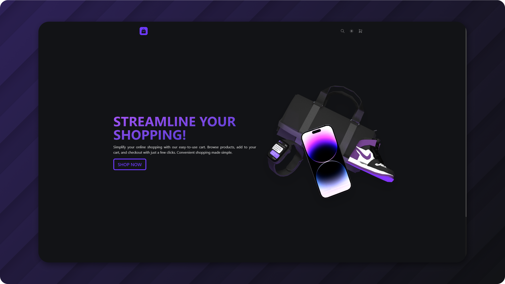

#

<h1 align="center">Shopping cart</h1>

  Shopping cart for <a href="https://www.theodinproject.com/">The Odin Project</a>

## Demo

👁️ [Live Demo](https://apheiro.github.io/Shopping_cart/)

## Built with

- [React](https://es.react.dev)
- [Vite](https://vitejs.dev)
- [TypeScript](https://www.typescriptlang.org)
- [React Router](https://reactrouter.com/en/main)
- [UnoCSS](https://unocss.dev)
- [Keen Slider](https://keen-slider.io)
- [Framer Motion](https://www.framer.com/motion/)
- [Html entities](https://github.com/mdevils/html-entities)
- [Query String](https://www.npmjs.com/package/query-string) (used it very little, only to test it)

## Features

- Product list.
- Product information.
- Cart.
- Search parameters.
- Result filters.
- _Smooth_ animations.

## Screenshots

